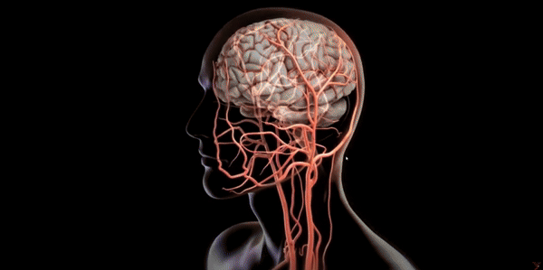

# MulTrans: A multi-task learning transformer framework for predicting post-thrombectomy cerebral hemorrhage
This repo contains the supported pytorch code and configuration files of our work

## The process of thrombectomy


## Overview of the MulTrans


## System requirements
This software was originally designed and run on a system running Ubuntu.

## Environment setup
In order to run our model, we suggest you create a virtual environment 
```
conda create -n medicaldiffusion python=3.8
``` 
and activate it with 
```
conda activate medicaldiffusion
```
Subsequently, download and install the required libraries by running 
```
pip install -r requirements.txt
```


## Train Model

python train.py

## Acknowledgements

This repository makes liberal use of code from [Swin Transformer](https://github.com/microsoft/Swin-Transformer), [Video Swin Transformer](https://github.com/SwinTransformer/Video-Swin-Transformer), [Swin-Unet](https://github.com/HuCaoFighting/Swin-Unet)


